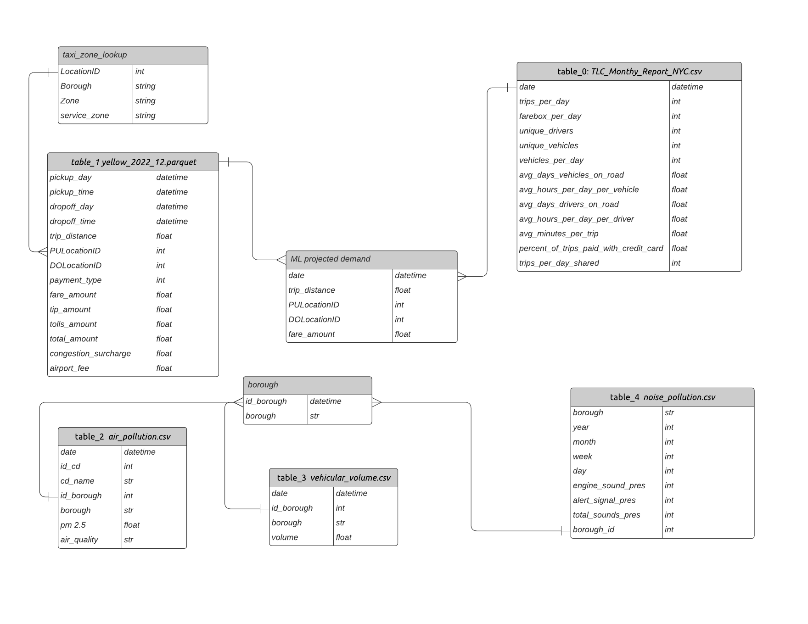

# <h1> ETL </h1> 

Se realizan procesos de extracción y transformación a datos que tienen información de la ciudad de New York:

Niveles de ruido presentes en la ciudad del año 2016-2020. 
Contaminación al aire desde el año 2008 al 2020. 
Viajes realizados por taxis amarillos desde el año 2010 hasta el 2023. 

 

*Los scripts necesarios para el desarrollo de las actividades puede ser consultado en: [ETL.ipynb](https://github.com/francomyburg/Proyecto_grupal_DS/blob/main/1.ETL/ETL-Databricks.ipynb).* *las tablas generadas por transformaciones de manera local pueden ser consultados en:* [data_finale](https://github.com/francomyburg/Proyecto_grupal_DS/tree/main/data/finale_dataset).

## 1. Extract

### 1.1 Extracción Estática

Se realiza una extracción estática a los datos que contienen los componentes ambientales. Se almacenan, se transforman localmente y se cargan a una base de datos en Azure SQL.

**Data Sources**

Air pollution NYC. 
https://data.cityofnewyork.us/Environment/Air-Quality/c3uy-2p5r 
API "https://data.cityofnewyork.us/resource/c3uy-2p5r.json"

Traffic Density/Volume NYC. 
https://data.cityofnewyork.us/Transportation/Automated-Traffic-Volume-Counts/7ym2-wayt  
API "https://data.cityofnewyork.us/resource/7ym2-wayt.json"

Noise pollution NYC. 
Registro de tipos de sonidos en NYC https://zenodo.org/record/3966543/files/annotations.csv?download=1 

### 1.1 Extracción Automática

Se realiza una extracción automática para los datos alojados en TLC Trip Record Data, el script detecta los nuevos datos que se carguen a partir de 2023 en la fuente de origen y los almacena en Azure Blob Storage.

**Data Sources**  

TLC Trip Record Data . 
https://www.nyc.gov/site/tlc/about/tlc-trip-record-data.page  

## 2. Transform

Datos que relacionan los viajes que realizan los taxis amarillos en NYC. [TLC Trip Record Data](https://www.nyc.gov/site/tlc/about/tlc-trip-record-data.page).

| **Data_source** | **Activities** |
|---|---|
| [TLC Trip Record   Data](https://www.nyc.gov/site/tlc/about/tlc-trip-record-data.page) | Se elimina **'VendorID', 'RatecodeID', 'store_and_fwd_flag'** |
| [TLC Trip Record   Data](https://www.nyc.gov/site/tlc/about/tlc-trip-record-data.page) | Se   identifican valores faltantes nan en **'passenger_count'**: 22188   **'congestion_surcharge'**:8195675 **'airport_fee'**: 8195675. |
| [TLC Trip Record   Data](https://www.nyc.gov/site/tlc/about/tlc-trip-record-data.page) | Se   imputa == 0 a las variables **'fare_amount'** **'extra'** **'mta_tax'** **'tolls_amount'** **'congestion_surcharge'** **'improvement_surcharge'** **'airport_fee'** con   valores faltantes nan. |
| [TLC Trip Record   Data](https://www.nyc.gov/site/tlc/about/tlc-trip-record-data.page) | Se aplica valor absoluto a todas las columnas con tipo de dato numérico (para contrarrestar valores negativos, cuyo valor absoluto es congruente).|
| [TLC Trip Record   Data](https://www.nyc.gov/site/tlc/about/tlc-trip-record-data.page) | Se eliminan filas con ubicación desconocida (valores 264 y 265) en **'PULocationID'** y **'DOLocationID'**.|
| [TLC Trip Record   Data](https://www.nyc.gov/site/tlc/about/tlc-trip-record-data.page) | Se eliminan filas con años no correspondientes al de la tabla actual en columna **'tpep_pickup_datetime'**.|
| [TLC Trip Record   Data](https://www.nyc.gov/site/tlc/about/tlc-trip-record-data.page) | Se eliminan filas con distancia igual a 0 o mayor a 250 millas en **'trip_distance'**.|

Datos del medio ambiente. 

| **Data_source** | **Activities** |
|---|---|
| [Air pollution   NYC](     https://data.cityofnewyork.us/resource/c3uy-2p5r.json) | Se   modifica la fecha en **'start_date'** a (YYYY-MM-DD) |
| [Air pollution   NYC](     https://data.cityofnewyork.us/resource/c3uy-2p5r.json) | Se   eliminan columnas **'unique_id', 'indicator_id',   'measure','geo_type_name','time_period', 'measure_info'** |
| [Air pollution   NYC](     https://data.cityofnewyork.us/resource/c3uy-2p5r.json) | Se   renombran categorías de la columna **'name'** |
| [Air pollution   NYC](     https://data.cityofnewyork.us/resource/c3uy-2p5r.json) | Se   crea columna nueva **'borough_name', 'id_borough'** |
| [Traffic   Density/Volume   NYC](https://data.cityofnewyork.us/resource/7ym2-wayt.json) | Se   renombran columnas **'Yr', 'M','D', 'Boro','date','Vol'** |
| [Traffic   Density/Volume   NYC](https://data.cityofnewyork.us/resource/7ym2-wayt.json) | Se   crea columna **'date',   'borough_name'** |
| [Noise   pollution NYC](      https://zenodo.org/record/3966543/files/annotations.csv?download=1) | Se reemplaza -1 por 1 en todo el   dataset |
| [Noise   pollution NYC](      https://zenodo.org/record/3966543/files/annotations.csv?download=1) | Se seleccionan del dataset las   columnas **['1-1_small-sounding-engine_presence',  '1-2_medium-sounding-engine_presence',  '1-3_large-sounding-engine_presence',   '1-X_engine-of-uncertain-size_presence'] y   [ '5-1_car-horn_presence', '5-2_car-alarm_presence',   '5-3_siren_presence',     '5-4_reverse-beeper_presence', '5-X_other-unknown-alert-signal_presence',   '6-1_stationary-music_proximity']** |
| [Noise   pollution NYC](      https://zenodo.org/record/3966543/files/annotations.csv?download=1) | se generan la columnas   **'engine_sounds' y 'alarm_sounds'** |
| [Noise   pollution NYC](      https://zenodo.org/record/3966543/files/annotations.csv?download=1) | se renombras columnas |
| [Noise   pollution NYC](      https://zenodo.org/record/3966543/files/annotations.csv?download=1) | se selecciona **['borough',   'year', 'week', 'day', 'hour', 'engine_sounds', 'alarm_sounds']** |

Se generan 5 tablas. 

| **table** | **name** |
|:---:|:---:|
| table_0 | _TLC_Monthy_Report_NYC.csv_ |
| table_1 | _yellow_2022_12.parquet_ |
| table_2 | _air_pollution.csv_ |
| table_3 | _vehicular_volume.csv_ |
| table_4 | _noise_pollution.csv_ |

## 3. Load

Se crea una base de datos SQl en Azure SQL. 

La tabla Ml Projected Demand corresponde al resultado del modelo de ML. Mientras que la tabla Borough y taxi_zone son tablas auxiliares destinadas a generar una mejor integración en el modelo de relación para facilitar búsquedas y consultas.

### 3.1 Carga de tablas de aspectos ambientales

Se carga estos datos de manera manual, desde la ubicación local de los datos transformados [data_finale](https://github.com/francomyburg/Proyecto_grupal_DS/tree/main/data/finale_dataset).

### 3.2 Carga de tabla de viajes de taxis

Se integra un Pipeline Auto Loader para procesar incrementalmente los nuevos archivos provenientes de la extracción automática y que están alojados en Azure Blob Storage. Se emplea Azure Databricks para realizar la carga, de forma que sólo acepte valores nulos en las columnas especificadas y que la estructura del archivo se apegue al esquema indicado. 

Los archivos se procesan automáticamente una vez el trabajo se calendariza en la sección Compute de Databricks. Se utiliza PySpark para realizar modificaciones antes de la carga final de las tablas ("Streaming Tables") y se transforman a un formato adecuado para Azure SQL Database. 

*En el siguiente enlace se puede visualizar de forma audiovisual el proceso de carga a la base de datos:* [Video de Automatización](https://www.youtube.com/watch?v=4nu3QpO49Kw)

*Developed by*

 **DATA ENGINEER**

 **DATA ANALYST**

 **DATA ENGINEER**

 **PROJECT MANAGER & DATA SCIENTIST**

 **DATA ENGINEER**

