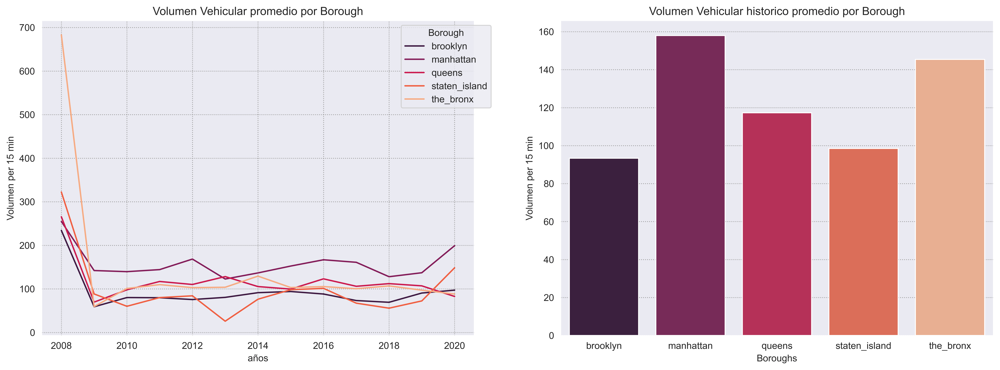
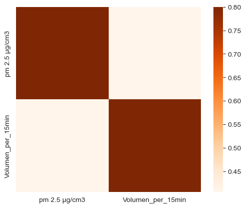

# <h1> Exploratory Data Analysis (EDA) </h1> 

## Componentes Medioambientales

Promedio de las cargas contaminantes presentes en en la ciudad de New York para cada Borough desde el 2008 hasta el 2020. 
**Material Particulado de 2.5 micras, Dioxido de Nitrogeno, Ozono** & **Dioxido de Azufre.**

Se utilizan los datos de PM 2.5 para establecer el **indice de calidad de aire**. Clasificación generada por IQAIR basado en los NAAQS (National Ambient Air Quality Standards) de la EPA (Environmental Protection Agency) de EE. UU.  

La EPA establece un indice de aire bueno cuando el PM 2.5 es inferior a 12 µg/cm3.  
La OMS (Organización Mundial de la Salud) sugiere para un indice de aire bueno en los años (2005-2021) un PM 2.5 inferior a 10 µg/cm3.  

con los registros obtenidos de los Automated Traffic Recorders en NYC se calcula **la densidad vehicular** presente en cada Borough. Esta variable representa la cantidad de vehiculos que pasan por determinado punto en un lapso de 15 minutos . 

Se Correlaciona la **densidad vehicular** con la generación de material particulado **PM2.5.**

*Developed by*

 **DATA ENGINEER**

 **DATA ANALYST**

 **DATA ENGINEER**

 **PROJECT MANAGER & DATA SCIENTIST**

 **DATA ENGINEER**

