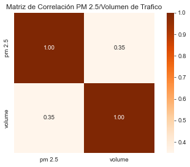

# <h1> Análisis Exploratorio de datos (EDA)</h1> 

## 1. Movimientos de taxis en New York

Se realiza un web scrapring para disponibilizar la data histórica de los viajes realizados por taxis en NYC. 
[1.disponibilizar.ipynb](1.disponibilizar_taxis.ipynb).  

- **Viajes mensuales de Taxis New York en 2010-2022**  
[3.EDA_taxis_viajes_mes.ipynb](https://github.com/francomyburg/Proyecto_grupal_DS/blob/main/2.EDA/3.EDA_taxis_viajes_mes.ipynb) 

Se Analizan los viajes realizados entre el 2010 y 2022. Se determina que la caída abrupta en el sector en el año 2020 ha sido por Covid-19. El número de viajes en taxis amarillos ha disminuido en un 80% desde el 2013 al presente año (2023).  

La facturación disminuyó más de 45% desde el 2013 hasta 2023.

Se evalúa la correlación entre las variables má influyentes a la cantidad de viajes.

- **Viajes de Taxis diarios Dic 2022**  
[2.EDA_taxis_viajes_diarios2.ipynb](https://github.com/francomyburg/Proyecto_grupal_DS/blob/main/2.EDA/2.EDA_taxis_viajes_diarios2.ipynb) 

Se analiza el mes de diciembre 2022, por ser el mes de mayor numero de viajes postcovid. Se calcula el valor promedio (USD) que tiene cada viaje realizado en taxis amarillos para cada borough.

Se analiza la demanda de viajes y la facturación para cada día de la semana.

Se valida la correlación entre las variables.

Las correlaciones más altas  corresponden a: 
   - Costo total del viaje (total_amount) vs. peajes (tolls_amount).
   - Recargo de congestion (congestion_surcharge) vs. Impuesto MTA.
   - Tasa por aeropuerto (airport_fee) vs. peajes (tolls_amount).
   - Costo total del viaje (total_amount) vs. Tasa por aeropuerto (airport_fee).

## 2. Componentes Medioambientales

### 2.1 **Contaminacón al aire**  
[4.EDA_air_pollution.ipynb](https://github.com/francomyburg/Proyecto_grupal_DS/blob/main/2.EDA/4.EDA_air_pollution.ipynb) 

Se analizan las mediciones de los distintos contaminantes presentes en los Boroughs de la ciudad de New York desde el año 2008 hasta el 2020. 

Se establece el promedio anual de las cargas contaminantes **Material Particulado de 2.5 micras, Dióxido de Nitrógeno, Ozono** & **Dióxido de Azufre.**  

Se utilizan los datos de PM 2.5 para establecer el **índice de calidad de aire**. Clasificación generada por IQAIR basado en los NAAQS (National Ambient Air Quality Standards) de la EPA (Environmental Protection Agency) de EE. UU.  

La EPA establece un índice de aire bueno cuando el PM 2.5 es inferior a 12 µg/cm3.  

### 2.2  **Densidad Vehicular**   
[4.EDA_air_pollution.ipynb](https://github.com/francomyburg/Proyecto_grupal_DS/blob/main/2.EDA/4.EDA_air_pollution.ipynb) 

Se calcula el **volumen vehicular** presente en cada Borough. Esta variable representa la cantidad de vehículos que pasan por determinado punto en un lapso de 15 minutos . 

Se obtiene una correlación del 35% entre el **volumen vehicular** con la generación de material particulado **PM2.5.**

### 2.3  **Contaminación Acustica**   
[5.EDA_noise_Pollution.ipynb](https://github.com/francomyburg/Proyecto_grupal_DS/blob/main/2.EDA/5.EDA_noise_Pollution.ipynb) 

Se analiza los datos de [data]. Este dataset registra las mediciones de presencia de sonidos que generan contaminación por ruido en los tres Boroughs más ruidosos de NYC en el año 2016 hasta el 2019. Los ruidos generados por los vehículos corresponden a los sonidos generados por el motor y los sonidos provenientes del sistema de alarma de los carros (sonidos de parqueo, claxon, alarma anti-robo etc).  

Se identifica el borough más ruidoso. (mayor cantidad de sonidos registrados) 

*Developed by*

 **DATA ENGINEER**

 **DATA ANALYST**

 **DATA ENGINEER**

 **PROJECT MANAGER & DATA SCIENTIST**

 **DATA ENGINEER**

