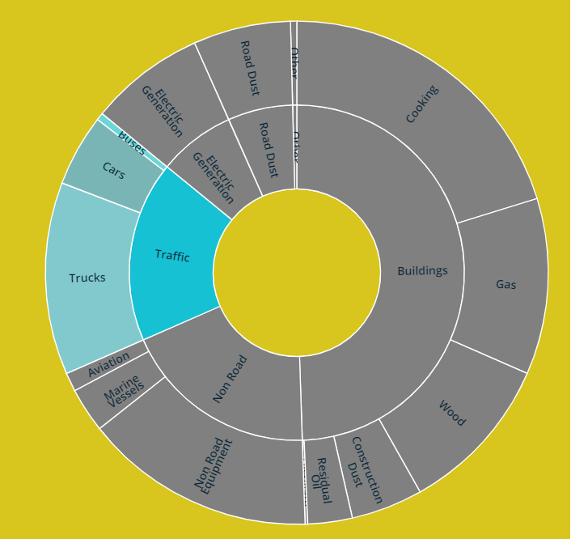
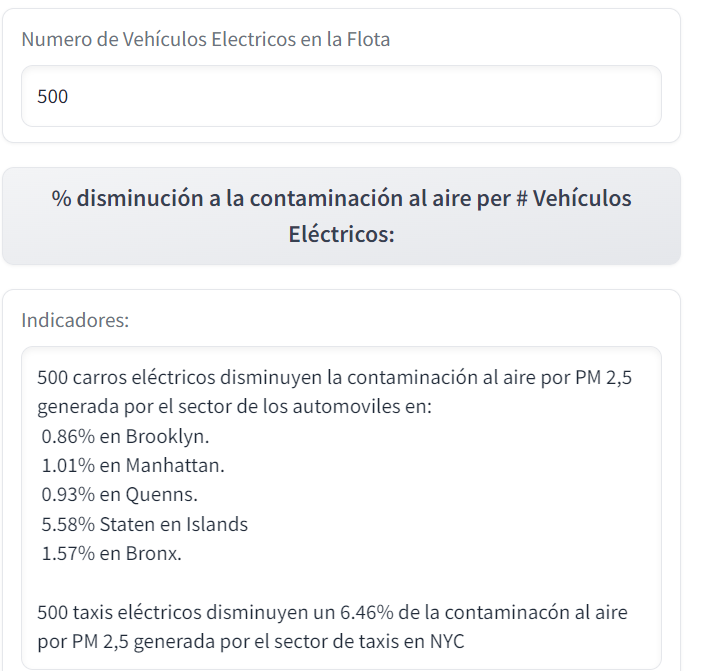
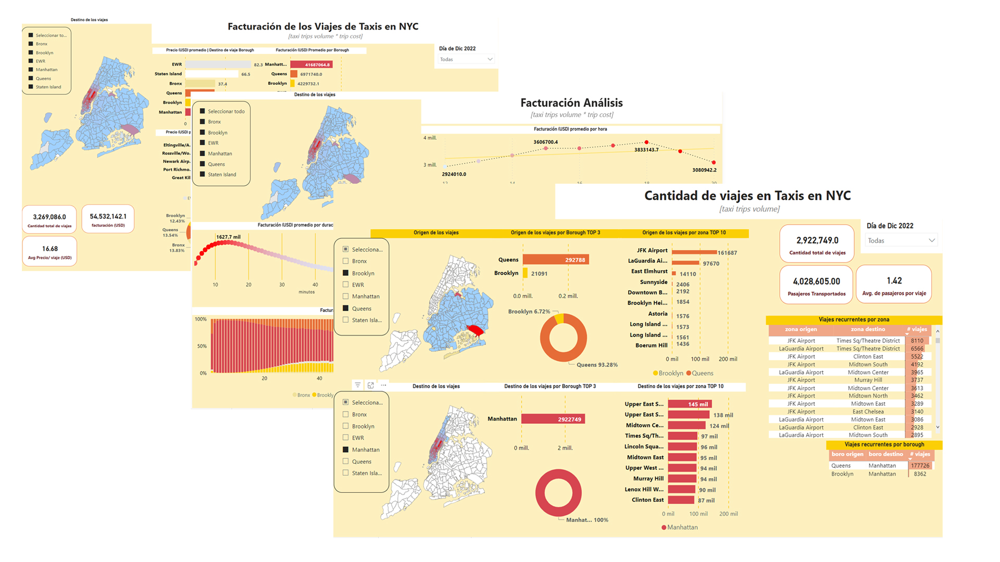

# <h1> COMPONENTES AMBIENTALES </h1> 

## Contaminación al aire

Acorde al departamento de salud de NYC. Se estima que de la contaminación al aire por PM 2,5 el 17% es generado por el sector de tráfico y el 5% proviene de los autos. [source](https://a816-dohbesp.nyc.gov/IndicatorPublic/Traffic/index.html) 

Se calcula el promedio total de la contaminación por PM 2,5 y el volumen vehicular en los boroughs de NYC. 

| **borough** | **volume #autos per 15min** | **Pm 2,5 µg/cm3** |
|:---:|:---:|:---:|
| Manhattan | 58420 |     10,9    |
| Queens | 54046 |     8,9    |
| Brooklyn | 49684 |     9,3    |
| Bronx | 31839 |     9,7    |
| Staten Island | 8962 |     8,5    |

La correlación entre el trafico y la contaminación por PM es del 35%. Se genera el KPI en %  de la disminución de contaminación si se implementan taxis eléctricos. 

Los cálculos a detalle pueden ser consultados en [calculator_pm.ipynb](https://github.com/francomyburg/Proyecto_grupal_DS/blob/main/4.REPORTS/calculator_pm.ipynb)

# <h1> ANALISIS FINANCIERO </h1> 

Se desarrolla un dashboard en Power Bi.
[dashboard](https://app.powerbi.com/view?r=eyJrIjoiNTI3MDA2YWMtZGU1Mi00N2Q5LWI2ZmEtNDA0Y2M4YWIyZGE5IiwidCI6ImRmODY3OWNkLWE4MGUtNDVkOC05OWFjLWM4M2VkN2ZmOTVhMCJ9)

Las zonas donde se produce el mayor número de viajes en taxis son Manhattan y los aeropuertos JFK y LaGuardia. En diciembre de 2022 el sector de taxis amarillos realizó 3,3 millones de viajes, transportó a 4,5 millones de personas y facturó 54,5 millones USD. El borough de Manhattan contribuye con el 76% de dicha facturación.

La proyección generada por el modelo ML indica que el maximo numero de taxis rondará los 9500 para abril del 2024 para decrecer progresivamente. El mercado seguira generando un tendencia bajista.

*Developed by*

 **DATA ENGINEER**

 **DATA ANALYST**

 **DATA ENGINEER**

 **PROJECT MANAGER & DATA SCIENTIST**

 **DATA ENGINEER**

