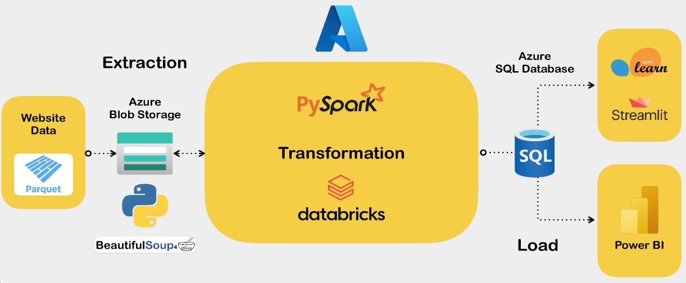

# <h1> Análisis de mercado para evaluar la viabilidad de la incorporación de vehículos eléctricos en el servicio de taxis en la ciudad de Nueva York. </h1> 
## **HENRY BOOTCAMP | Proyecto Final**

# 1. Introducción

Se lleva a cabo un análisis del sector de transporte público en los taxis amarillos de la ciudad de Nueva York con el fin de evaluar la viabilidad de invertir en tecnologías sostenibles como la implementación de flotas de vehículos eléctricos. Se analizan datos en NYC de los sonidos registrados por el tráfico, la contaminación en el aire, el movimiento de vehículos por zona y los viajes que realizan los taxis en la ciudad para  los 5 Boroughs (distritos) de New York: **Manhattan, Brooklyn, Queens, The Bronx & Staten Island**.Se implementa un modelo de Machine Learning  para estimar tendencias a futuro de los principales indicadores. Se realiza un Dashboard para la visualización de los datos y resultados obtenidos.  

El proyecto se ejecuta bajo metodología ágil Scrum y se desarrolla en cuatro etapas. 
**Etapa 1:** Recopilación de los datos, **Etapa 2:** Creación de base de datos, **Etapa 3:** Análisis Económico, KPIs y **Etapa 4:** Modelo ML.  

La gestión del proyecto se desarrolla en: 
*Actividades [Task:](https://trello.com/b/BBq6OTiJ/proyecto-final) Cronograma [Gant:](https://docs.google.com/spreadsheets/d/10gupD91IRV9KfblHfoy6fAw1rV6vu_gw6LNHp0itnfo/edit#gid=1709744959)*

# 2. Objetivos

- Identificar patrones y tendencias en los movimientos de taxis en NYC (2010-2022). 
- Investigar la relación entre el movimiento de los taxis y la calidad del aire y la contaminación sonora en NYC, para determinar alguna  correlación existente.  
- Realizar un análisis de las ganancias económicas del sector.  
- Desarrollar un Modelo de ML para estimar comportamientos futuros del sector de transporte de taxi en NYC. 

# 3. Desarrollo

## 3.1 Recursos implementados

- **Gestión del proyecto:** Google meet, Trello. 
- **EDA, ETL, SQL BD:** Python, Beautiful Soup, Pandas, Matplotlib,  Seaborn, PySpark, SQLAlchemy , Azure SQL.  
- **Business Intelligence & Machine Learning:** SQLAlchemy, Plotly, PowerBI, Scikit-learn, Streamlit.  
- **Cloud:** Azure (Azure Data Factory, Azure Blob Storage, Azure Synapse Analytics)  

## 3.2 Obtencción de los Datos

Los datos se extraen de fuentes oficiales que proporciona  New York.  [**Taxi & Limousine Commission**](https://www.nyc.gov/site/tlc/about/tlc-trip-record-data.page) y de los datos abiertos de la ciudad [**Open_Data_NYC**](https://data.cityofnewyork.us/).  

*El **Diccionario de los datos** puede consultarse en [data_dict](https://github.com/francomyburg/Proyecto_grupal_DS).*

# 4. ETL/EDA

Se desarrolla un sistema que extrae datos de manera automática de [**Taxi & Limousine Commission**](https://www.nyc.gov/site/tlc/about/tlc-trip-record-data.page) los transforma y los carga por medio de un pipeline a una base de datos SQL en la nube de Azure. 

Al realizar el análisis exploratorio de los datos, se determina que:

- La crisis covid-19 afectó las actividades del sector en 2020.
- El número de viajes en taxis amarillos ha disminuido en un 80% desde el 2013 al presente año (2023).
- Las zonas donde se produce el mayor número de viajes en taxis son Manhattan y los aeropuertos JFK y LaGuardia. En diciembre de 2022 el sector de taxis amarillos realizó 3,3 millones de viajes, transportó a 4,5 millones de personas y facturó 54,5 millones USD. El borough de Manhattan contribuye con el 76% de dicha facturación.
- La facturación promedio por día y por vehiculo disminuyó más de 45% desde el 2013 hasta 2023.
- El borough con la peor calidad de aire, mayor contaminación por ruido y mayor volumen de tráfico vehicular es Manhattan. 

 *Los aspectos más importantes de este proceso se pueden consultar en: [ETL](https://github.com/francomyburg/Proyecto_grupal_DS/tree/main/1.ETL) y el [EDA](https://github.com/francomyburg/Proyecto_grupal_DS/tree/main/2.EDA).* 

# 5. Resultados

## 5.1 KPIs 

-  Porcentaje de la cantidad de viajes proyectada. 
-  Porcentaje de la cuota del mercado proyectado. 
-  Ingresos brutos por día/mes. 
-  Porcentaje de disminución de contaminante (PM 2,5) en el aire por implementar vehículos eléctricos. 
-  Reducción porcentual de contaminación acústica por implementar vehículos eléctricos.  

## 5.2 App

Se generan  métricas e indicadores clave de rendimiento a través de una app desarrollada en Streamlit con un dashboard de PowerBi embebido y un modelo ML de forecasting.

La proyección generada por el modelo ML indica que el maximo numero de taxis rondará los 9500 para abril del 2024 para decrecer progresivamente.

# 6. Conclusiones

*Developed by*

 **DATA ENGINEER**

 **DATA ANALYST**

 **DATA ENGINEER**

 **PROJECT MANAGER & DATA SCIENTIST**

 **DATA ENGINEER**

