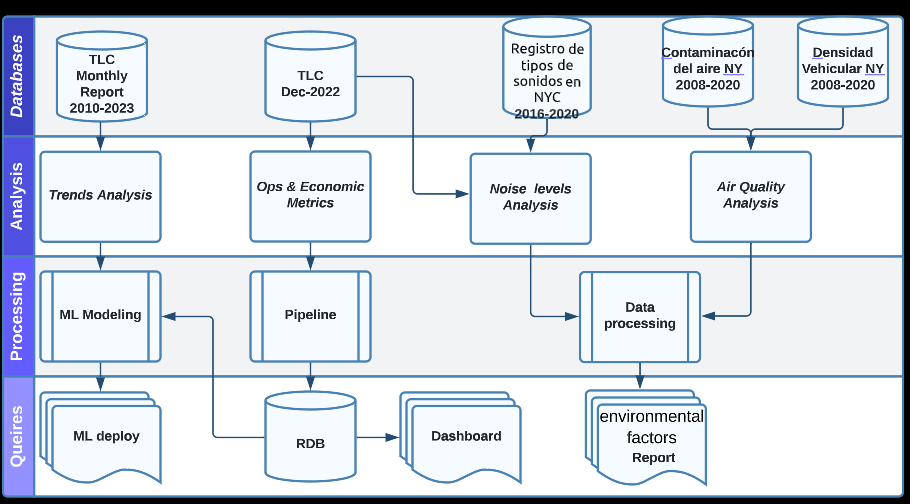

# <h1> Análisis de datos para observar viabilidad de vehículos Eléctricos en el Servicio de Transporte de Pasajeros con Automóviles en la ciudad de New York </h1> 
## **HENRY BOOTCAMP | Proyecto Final**

## 1. Introducción

Se lleva a cabo un análisis del sector de transporte público en automóviles en la ciudad de Nueva York con el fin de evaluar la viabilidad de invertir en tecnologías más sostenibles, como la implementación de flotas de vehículos eléctricos. 

Se analizan tres categorias de transporte de pasajero por taxis presentes en NYC *Yellow Cabs: taxis de color amarillo, Green Cabs: taxis color verde introducidos a NYC desde el 2013, FHV cars: limosinas, carros por renta.* Se analizan los niveles de ruido presentes en la ciudad del año 2016-2020 y la calidad del aire desde el año 2008 al 2020, el movimiento de vehículos desde el año 2010 hasta el 2023 en los 5 distritos en NY: Manhattan (New York County), Brooklyn (Kings County), Queens (Queens County), The Bronx (Bronx County) & Staten Island (Richmond County). Se implementa un modelo ML para estimar tendencias a futuro de los principales indicadores. Se realiza un Dashboard para la visualización de los datos con el mes de mayor actividad en el sector (Diciembre 2022).  

El proyecto se ejecuta bajo metodología ágil Scrum y se desarrolla en cuatro etapas. 

**Etapa 1: Recopilación de los datos** 
Se realizan procesos de recopilación y limpieza de la información. Se desarrolla un EDA.   

**Etapa 2: Creación de base de datos (DW)**  

Se crea un DataWarehouse con una carga inicial automatizada de manera incremental en el servicio cloud de Microsoft Azure. 

**Etapa 3: Análisis Económico del sector & KPIs**  

Se analiza el perfil económico del sector de transporte de pasajeros en vehiculos en NYC para generar metricas y 5 KPI's:  

**Etapa 4: Modelo ML**  
Se desarolla un modelo de Machine Learning de clasificación de clientes.  

La gestión del proyecto se desarrolla en: 
*Actividades [Task:](https://trello.com/b/BBq6OTiJ/proyecto-final) Cronograma [Gant:](https://docs.google.com/spreadsheets/d/10gupD91IRV9KfblHfoy6fAw1rV6vu_gw6LNHp0itnfo/edit#gid=1709744959)*

## 2. Objetivos

- Identificar patrones y tendencias en los movimientos de taxis en la ciudad de Nueva York (2010-2022).

  -- Mayores promedios de distancias según origen/destino 

  -- Cantidad de viajes según origen/destino 

  -- Montos de viajes según origen/destino

  -- Días y horarios con mayor demanda  

- Explorar y analizar la calidad del aire y la contaminación sonora en la ciudad de Nueva York en relación con el movimiento de los taxis, utilizando técnicas de visualización de datos y análisis estadísticos. 

- Evaluar la relación entre el movimiento de los taxis y la calidad del aire y la contaminación sonora en la ciudad de Nueva York, para determinar si existe alguna correlación significativa.  

- Análisis de las ganancias económicas del sector.  
  -- Ingreso bruto promedio hora/día/mes  
  -- Proporcion de ingresos por tarifa cliente/empresa 

- Desarrollar un Modelo de ML de clasificación de usuarios de taxis en la ciudad de Nueva York  para  plantear  estrategias de marketing por microsegmentación. 
  -- Modelo de estimación de tarifa según borough y horario  

- Identificar los desafíos y oportunidades relacionados con la implementación de vehículos eléctricos en la flota de la empresa de servicios de transporte de pasajeros, y evaluar los posibles beneficios ambientales y económicos.

 <h2 align="center">KPIs asociados a los objetivos(planteo)</h2> 

- 1-Distancia por vehículo (ganancia por kilometro)

    Mayores promedios de distancias según origen/destino 

    Cantidad de viajes según origen/destino 

    Montos de viajes según origen/destino

    Dias y horarios con mayor demanda

- 2-Indice de calidad del aire (Variación anual en MP 2,5 per m2)

- 3-Contaminación Acústica (Variación anual en Decibeles per m2)

- 4-Ingresos brutos/netos cliente/empresa por dia/mes

    Tarifa/distancia (correlación)

- 5-Cuota del mercado proyectado

## 3. Recursos implementados

- Gestión de proyectos: Google meet, Trello. 

- Ingenieria de datos (EDA, ETL, DATAWAREHOUSE): Python, Pandas, Matplotlib,  Seaborn , SQLAlchemy , PostgreSQL.  

- Análisis de datos (Business Intelligence & Machine Learning): Python, Pandas, SQLAlchemy , Plotly, PowerBI, Scikit-learn, Streamlit.  

- Escalabilidad On Cloud: Azure (Azure Data Factory, Azure Blob Storage, Azure Synapse Analytics)  

## 4. Recopilación de los datos

El origen de los datos:

TLC Trip Record Data . 

https://www.nyc.gov/site/tlc/about/tlc-trip-record-data.page 

Contaminacón del aire NYC. 

https://data.cityofnewyork.us/Environment/Air-Quality/c3uy-2p5r 
API "https://data.cityofnewyork.us/resource/c3uy-2p5r.json"

Densidad de Trafico NYC. 

https://data.cityofnewyork.us/Transportation/Automated-Traffic-Volume-Counts/7ym2-wayt  
API "https://data.cityofnewyork.us/resource/7ym2-wayt.json"

Contaminacón Acústica NYC. 

Registro de tipos de sonidos en NYC. 
https://zenodo.org/record/3966543/files/annotations.csv?download=1 

Reporte de los registros al servicio 311 del gobierno NYC.  

API "https://data.cityofnewyork.us/resource/erm2-nwe9.json"

## 5. EDA

[EDA](https://docs.google.com/presentation/d/1JpArF9OQ-drCRJC0h2I5K6-4FtqC2zgzeXRlCp0JW94/edit#slide=id.g1e1000ce16a_3_11)

*Developed by*

 **DATA ANALYST**

 **DATA ENGINEER**

 **DATA ENGINEER**

 **PROJECT MANAGER & DATA SCIENTIST**

 **DATA SCIENTIST**

