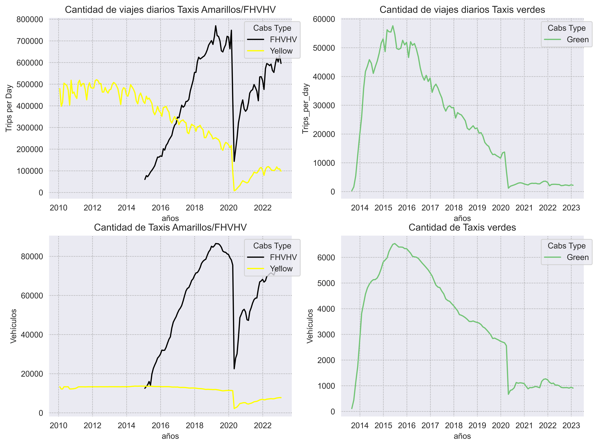
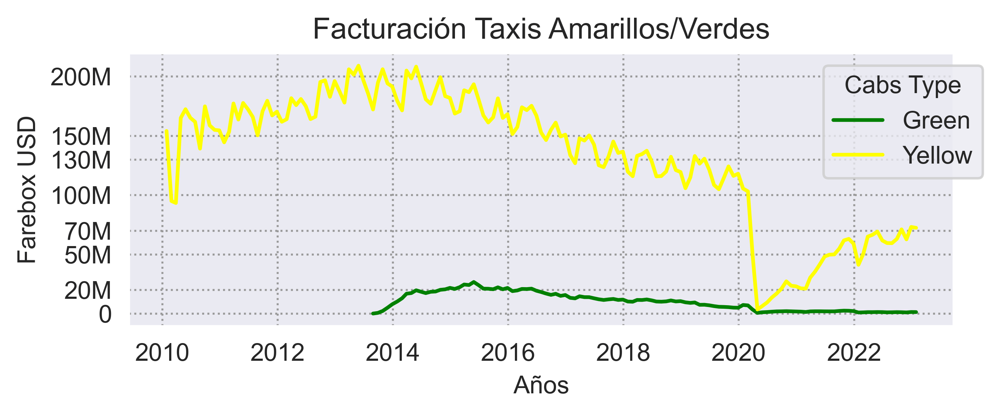

# <h1> Análisis Exploratorio de datos (EDA)</h1> 

## 1. Movimientos de taxis en New York

Se realiza un web scrapring para disponibilizar la data histórica de los servicios de transporte de pasajeros en automóviles en NYC [1.disponibilizar.ipynb](1.disponibilizar.ipynb).  

Se analizan dos datasets, correspondientes a los diferentes tipos de taxis existentes en NYC.
**Taxis Amarillos**, **Taxis verdes** y **Taxis FHV (plataformas: Uber, Lyft & renta)**. 

- **Viajes mensuales de Taxis New York en 2010-2022**  
[EDA_yellow_cabs_DIC22.ipynb](EDA_Yellow_Cabs_DIC22.ipynb) 

- **Viajes de Taxis Amarillos, Verdes New York 2018 & FHV New York 2019**  
[EDA_yellow_cabs.ipynb](EDA_yellow_cabs.ipynb) 
[EDA_green_cabs.ipynb](EDA_green_cabs.ipynb) 
[EDA_fhv_cabs.ipynb](EDA_fhv_cabs.ipynb) 

## 2. Componentes Medioambientales

- **Contaminacón al aire**   [EDA_Air_Quality.ipynb](EDA_Air_Quality.ipynb)

Se filtra el dataset por 'CD' community districts. Se analizan los datos por las diferentes cargas contaminantes presentes en los Boroughs. Se establece la metrica **Indice de calidad del aire**  

- **Densidad Vehicular**      [EDA_Air_Quality.ipynb](EDA_Air_Quality.ipynb)

Se filtra el dataset desde el año 2008 al 2020. Se calcula la **Densidad Vehicular** en los Boroughs. Se genera el KPI .

- **Contaminación Acustica**  [EDA]()

| Diccionario                                                     | Table | EDA_file                        | Activities                                                                                                                                                                                                                                         |
|-----------------------------------------------------------------|-------|---------------------------------|----------------------------------------------------------------------------------------------------------------------------------------------------------------------------------------------------------------------------------------------------|
| tlc_amarillos                                                   | NA    | EDA_yellow_cabs                 | Se elimina **'VendorID', 'RatecodeID', 'store_and_fwd_flag'**                                                                                                                                                                                      |
| tlc_verdes                                                      | NA    | EDA_green_cabs                  | Se eliminan columnas **'VendorID' 'store_and_fwd_flag', 'RatecodeID', 'ehail_fee'**                                                                                                                                                                |
| tlc_verdes, tlc_amarillos                                       | NA    | EDA_green_cabs, EDA_yellow_cabs | Se Separa 'lpep_pickup_datetime' y 'lpep_dropoff_datetime'  en d�a (YYYY-MM-DD) **Hora de pickup**, **Hora de dropoff**.                                                                                                                           |
| tlc_verdes, tlc_amarillos                                       | NA    | EDA_green_cabs, EDA_yellow_cabs | "Se insertan las variables **'dropoff_time' 'pickup_day' 'pickup_time' 'dropoff_day'**	"                                                                                                                                                           |
| tlc_verdes, tlc_amarillos                                       | NA    | EDA_green_cabs, EDA_yellow_cabs | "                                                                                                                                                                                                                                                  |
| Se elimina **'lpep_pickup_datetime'  'lpep_dropoff_datetime'**" |       |                                 |                                                                                                                                                                                                                                                    |
| tlc_verdes                                                      | NA    | EDA_green_cabs                  | Se identifican valores faltantes nan en **'passenger_count':** 34623 & **'payment_type ':** 34623  **'trip_type':** 35019  **'congestion_surcharge':** 719654.                                                                                     |
| tlc_amarillos                                                   | NA    | EDA_yellow_cabs                 | Se identifican valores faltantes nan en **�passenger_count�**: 22188 **�congestion_surcharge�**:8195675 **�airport_fee�**: 8195675.                                                                                                                |
| tlc_amarillos                                                   | NA    | EDA_yellow_cabs                 | Se imputa == 0 a las variables **'congestion_surcharge' 'airport_fee'** con valores faltantes nan.                                                                                                                                                 |
| tlc_verdes                                                      | NA    | EDA_green_cabs                  | Se imputa == 0 a las variables **'congestion_surcharge'** con valores faltantes nan.                                                                                                                                                               |
| tlc_verdes, tlc_amarillos                                       | NA    | EDA_green_cabs, EDA_yellow_cabs | Se imputa valores de la media a las variables **'trip_distance' 'fare_amount' 'tip_amount' 'passenger_count' 'tolls_amount' 'improvement_surcharge'** con valores faltantes nan.                                                                   |
| tlc_verdes, tlc_amarillos                                       | NA    | EDA_green_cabs                  | Se modifica variables a *float type.*  a **'congestion_surcharge'**.                                                                                                                                                                               |
| tlc_verdes, tlc_amarillos                                       | NA    | EDA_green_cabs, EDA_yellow_cabs | Se imputa valores de la moda las variables **'payment_type'** , **'trip_type'** , **'extra'**, **'mta_tax'** con valores faltantes nan.                                                                                                            |
| tlc_fhv                                                         | NA    | EDA_fhv_cabs                    | Se eliminan las variables **'hvfhs_license_num', 'dispatching_base_num', 'originating_base_num', 'request_datetime', 'on_scene_datetime', 'shared_request_flag', 'shared_match_flag', 'access_a_ride_flag', 'wav_request_flag', 'wav_match_flag'** |
| tlc_fhv                                                         | NA    | EDA_fhv_cabs                    | Se identifican valores faltantes nan en **'airport_fee'**: 22243779                                                                                                                                                                                |
| tlc_fhv                                                         | NA    | EDA_fhv_cabs                    | Se imputa == 0 a las variables **'airport_fee'** con valores faltantes nan.                                                                                                                                                                        |
| tlc_fhv                                                         | NA    | EDA_fhv_cabs                    | Se imputa valores de la media a las variables  **'trip_miles' 'driver_pay' 'sales_tax' 'tolls' 'base_passenger_fare' 'trip_time'**                                                                                                                 |
| ;                                                               | ;     | ;                               |                                                                                                                                                                                                                                                    |

*Se puede consultar el reporte de los componente medioambientales en:*  [3.ENVIROMENTAL_REPORT](../3.ENVIROMENTAL_REPORT) 

*Developed by*

 **DATA ENGINEER**

 **DATA ANALYST**

 **DATA ENGINEER**

 **PROJECT MANAGER & DATA SCIENTIST**

 **DATA ENGINEER**

