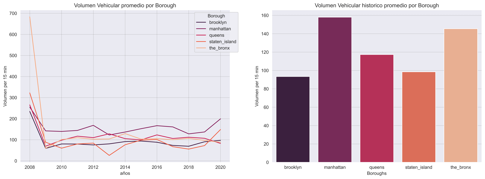
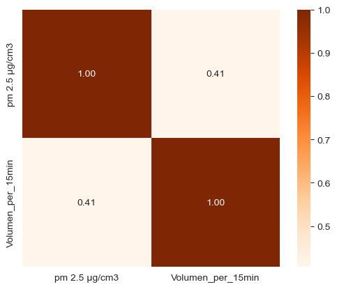
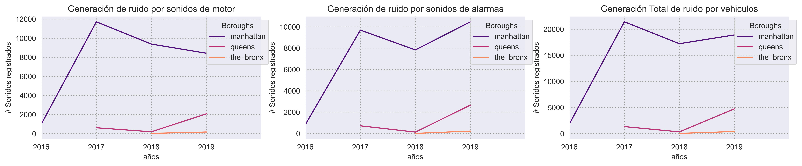

# <h1> COMPONENTES AMBIENTALES </h1> 

## Contaminación al aire.

Se analizan los datos de [data]. Este dataset registra las mediciones de los distintos contaminantes presentes en los Boroughs de la ciudad de New York desde el año 2008 hasta el 2020. 

Se establece el promedio anual de las cargas contaminantes **Material Particulado de 2.5 micras, Dióxido de Nitrógeno, Ozono** & **Dióxido de Azufre.**  

Se utilizan los datos de PM 2.5 para establecer el **índice de calidad de aire**. Clasificación generada por IQAIR basado en los NAAQS (National Ambient Air Quality Standards) de la EPA (Environmental Protection Agency) de EE. UU.  

La EPA establece un índice de aire bueno cuando el PM 2.5 es inferior a 12 µg/cm3.  
La OMS (Organización Mundial de la Salud) sugiere para un índice de aire bueno en los años (2005-2021) un PM 2.5 inferior a 10 µg/cm3.
  

con los registros obtenidos de los Automated Traffic Recorders en NYC [data] se calcula el **volumen vehicular** presente en cada Borough. Esta variable representa la cantidad de vehículos que pasan por determinado punto en un lapso de 15 minutos . 

Se obtiene una correlación del 35% entre el **volumen vehicular** con la generación de material particulado **PM2.5.**

## Contaminación acústica

Se analiza los datos de [data]. Este dataset registra las mediciones de presencia de sonidos que generan contaminación por ruido en los tres Boroughs más ruidosos de NYC en el año 2016 hasta el 2019. Los ruidos generados por los vehículos corresponden a los sonidos generados por el motor y los sonidos provenientes del sistema de alarma de los carros (sonidos de parqueo, claxon, alarma anti-robo etc).  

Se identifica el borough más ruidoso. (mayor cantidad de sonidos registrados) 

## Calculadora Impacto Ambiental

La OMS ha establecido una meta desde el 2021 para la calidad del aire a nivel mundial. Se basa en la reducción del promedio anual de PM 2.5 a un límite superior de 5 µg/cm3. Por tanto, las ciudades deben adoptar políticas y mecanismos que permitan el acercamiento a este objetivo. 

El porcentaje de disminución que requiere New York en cada uno de sus Boroughs para alcanzar los 5 µg/cm3 es:

| **borough** | **PM    2.5 µg/cm3 actual** | **Meta PM 2.5 µg/cm3** | **% Disminución para el objetivo** |
|---|---|---|---|
| _brooklyn_ | _9,3_ | _5_ | _-85_ |
| _manhattan_ | _10,9_ | _5_ | _-117_ |
| _queens_ | _8,9_ | _5_ | _-79_ |
| _staten_island_ | _8,5_ | _5_ | _-70_ |
| _the_bronx_ | _9,7_ | _5_ | _-94_ |

Se calcula el impacto ambiental positivo generado por la implementación de vehiculos electricos en una flota de transporte, a traves del desarrollo de dos indicadores:

****
****

Se desarrolla en Streamlit 

# Conclusiones

Acorde al standard establecido por la EPA el Borough que peor calidad de aire tiene es Manhattan, tambien posee la mayor cantidad de transito vehicular. Esto reafirma la correlación existente entre el volumen vehicular y la contaminación en el aire por PM 2.5

*Developed by*

 **DATA ENGINEER**

 **DATA ANALYST**

 **DATA ENGINEER**

 **PROJECT MANAGER & DATA SCIENTIST**

 **DATA ENGINEER**

